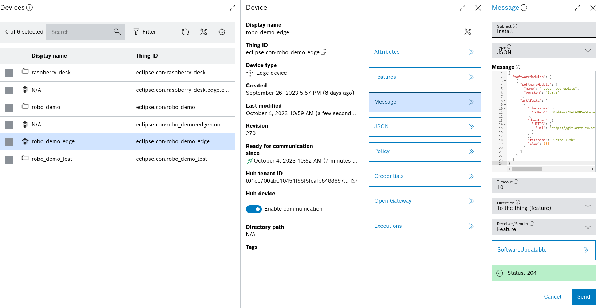

# eclipsecon-demo

## Kanto integration
In order to add kanto integration for the blueprint. First of all, add [meta-kanto layer](https://github.com/eclipse-kanto/meta-kanto).
Then, add the following recipes to the blueprint image:
```
ADD_KANTO = " \
    system-metrics \
    suite-connector \
    software-update \
    update-manager \
    file-upload \
    file-backup \
"

IMAGE_INSTALL:append = " \
    ${ADD_KANTO} \
"
```

Add provisioning.json file in `meta-kanto/recipes-connectivity/suite-connector/files/`
and include it in the SRC_URI
```
--- a/recipes-connectivity/suite-connector/suite-connector_git.bb
+++ b/recipes-connectivity/suite-connector/suite-connector_git.bb
@@ -6,6 +6,7 @@ LIC_FILES_CHKSUM = "file://src/${GO_IMPORT}/LICENSE;md5=54cd967551e55d39f55006d3
 SRC_URI = "git://github.com/eclipse-kanto/suite-connector;protocol=https;branch=main \
            file://config.json \
            file://service.template \
+           file://provisioning.json \
            "
 
 SRCREV = "${AUTOREV}"
```

### Note
The file system needs to be read-write:
- in the local.conf set `ROOT_FSTYPE = "ext4"`
- after the raspberry pi has booted run 
```
mount -o remount,rw /dev/mmcblk0p2 /
```


## Send software update from bosch IoT suite

- Open the [devices](https://console.bosch-iot-suite.com/devices) panel and 
select the edge device.
- Send a message with subject "install" and choose a message content from below.
- Select "Feature" and pick `SoftwareUpdatable` as feature.

For green robot face:
```
{
  "softwareModules": [
    {
      "softwareModule": {
        "name": "robot-face-update",
        "version": "1.0.0"
      },
      "artifacts": [
        {
          "checksums": {
            "SHA256": "98f5d39eaae23be5226c891ae41fade8f13af42b601ddfeb5812a14024b703c5"
          },
          "download": {
            "HTTPS": {
              "url": "https://git.ostc-eu.org/francesco.pham/eclipsecon-demo/-/raw/main/robot_face_update_green.sh"
            }
          },
          "filename": "install.sh",
          "size": 180
        }
      ]
    }
  ]
}
```

For orange robot face:
```
{
  "softwareModules": [
    {
      "softwareModule": {
        "name": "robot-face-update",
        "version": "1.0.0"
      },
      "artifacts": [
        {
          "checksums": {
            "SHA256": "07485454b2dff9c1bef1d2a319fa977908fbafed3c50f1f1bc38a622e30fbf25"
          },
          "download": {
            "HTTPS": {
              "url": "https://git.ostc-eu.org/francesco.pham/eclipsecon-demo/-/raw/main/robot_face_update_orange.sh"
            }
          },
          "filename": "install.sh",
          "size": 180
        }
      ]
    }
  ]
}
```

For purple robot face:
```
{
  "softwareModules": [
    {
      "softwareModule": {
        "name": "robot-face-update",
        "version": "1.0.0"
      },
      "artifacts": [
        {
          "checksums": {
            "SHA256": "2d4b27ec7fe404f2d3ab80b7ad05452459c45af3c3c2176b7f8f988eb0fce0e6"
          },
          "download": {
            "HTTPS": {
              "url": "https://git.ostc-eu.org/francesco.pham/eclipsecon-demo/-/raw/main/robot_face_update_purple.sh"
            }
          },
          "filename": "install.sh",
          "size": 180
        }
      ]
    }
  ]
}
```

For white robot face:
```
{
  "softwareModules": [
    {
      "softwareModule": {
        "name": "robot-face-update",
        "version": "1.0.0"
      },
      "artifacts": [
        {
          "checksums": {
            "SHA256": "00d4ae772ef6086e5fa3ec7cfb2ebc1028c4977679cff5f580fcc2164b7f337a"
          },
          "download": {
            "HTTPS": {
              "url": "https://git.ostc-eu.org/francesco.pham/eclipsecon-demo/-/raw/main/robot_face_update_white.sh"
            }
          },
          "filename": "install.sh",
          "size": 180
        }
      ]
    }
  ]
}
```

For blue robot face:
```
{
  "softwareModules": [
    {
      "softwareModule": {
        "name": "robot-face-update",
        "version": "1.0.0"
      },
      "artifacts": [
        {
          "checksums": {
            "SHA256": "277c3d6edc1e07685fb6458ed1be975204a136ccda4185d0635d871990a2a24d"
          },
          "download": {
            "HTTPS": {
              "url": "https://git.ostc-eu.org/francesco.pham/eclipsecon-demo/-/raw/main/robot_face_update_blue.sh"
            }
          },
          "filename": "install.sh",
          "size": 180
        }
      ]
    }
  ]
}
```
